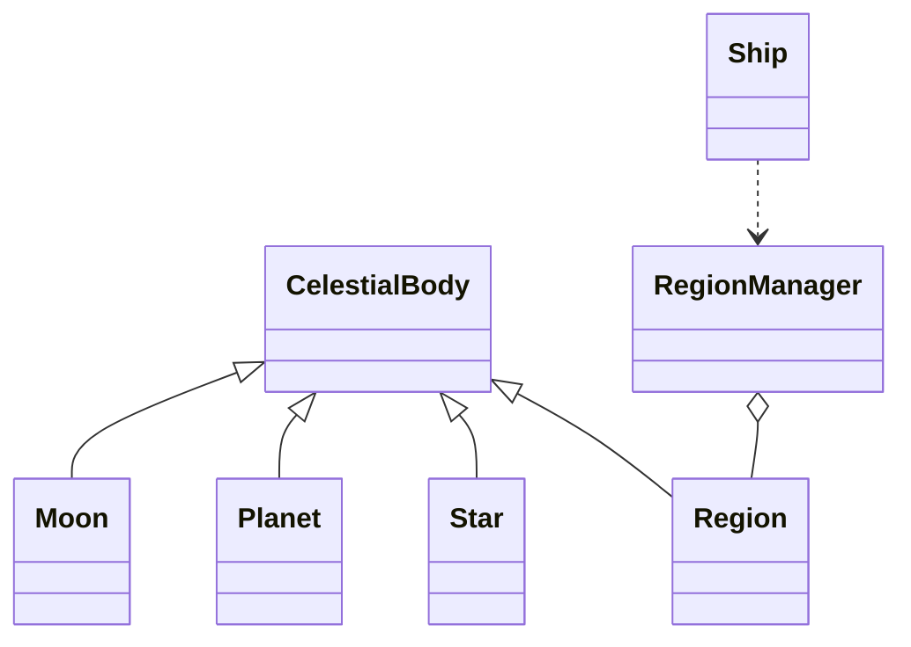

# void3

A modular TypeScript project for space visualization and simulation built with Three.js and a small systems architecture.

---

## Table of Contents

- Quick start
- Usage
- Development
- Testing
- Contributing
- License

## Quick start 🚀

Prerequisites: Node.js (LTS), pnpm

1. Install dependencies: `pnpm install`
2. Dev: `pnpm dev`
3. Build: `pnpm build`
4. Preview: `pnpm preview`

## Usage

Open `index.html` or run the dev server and open the dev URL to explore the visualization. The primary entrypoint is `src/main.ts`.

### Demos

- KBC Void demo: start the dev server and open `/kbc.html` to render the KBC region.

Commands:

- `pnpm kbc` — start dev server and open the site, then visit `http://localhost:5173/kbc.html` (or the port Vite reports).

Note: The KBC demo performs procedural generation (many shapes and galaxies) and may be slow on low-end machines; reduce population sizes in `src/void/cosmic_web/KBC.ts` if needed.

## Development

- Type-check: `pnpm -w run typecheck`
- Recommended editor: VS Code with TypeScript and Prettier
- Keep modules small and document public APIs in folder READMEs

## Notes

- 2026-01-18: The main render loop now explicitly calls `solarSystem.update(delta)` each frame to ensure region objects (e.g., `SolarSystem`) perform lazy creation and per-frame updates (stars, planets, satellites).
- 2026-01-18: The initial camera is focused on the Sun by default so the scene is visible on load.
- I reviewed the repository to confirm these behaviors and where updates were made (see `src/main.ts`, `src/void/regions/SolarSystem.ts`).

## Testing

We use Vitest for unit tests. Run tests interactively with:

```
pnpm test
```

To run the tests once (CI mode):

```
pnpm test -- --run
```

Included tests:

- `src/__tests__/regionManager.test.ts` — covers RegionManager selection edge cases (entry/exit thresholds and nearest-region tie-breakers).

Note: the Vitest configuration in `vitest.config.ts` inlines `three` to avoid Vite SSR interop issues; add other deps to `deps.inline` if you add more tests that import third-party libs.

---

## Architecture & Diagrams 🧭

This repository models a simple scene graph and runtime update loop for a space simulation. Key concepts:

- **CelestialBody (base)** — common base for `Region`, `Star`, `Planet`, `Moon`; provides `update(delta)` lifecycle, orbit/physics fields, `create()`, and `destroy()` hooks.
- **Region** — a specialized `CelestialBody` that acts as a root container (e.g., `SolarSystem`, `Galaxy`), exposing `entry`, `exit`, `radius` thresholds for region management.
- **RegionManager** — global singleton that tracks registered regions, chooses the active region based on camera distance vs `entry`/`exit`, and emits `enter`/`exit` events.
- **Ship** — camera/controller that listens to RegionManager, updates camera limits, and focuses on regions/objects.

Runtime flow (high-level):

1. `animate()` -> `solarSystem.update(delta)` which recursively updates bodies.
2. `regionManager.update(camera, delta)` chooses active region and updates LODs.
3. `display.render(space, ship.camera)` renders the scene.

Mermaid class diagram (compact):



To view the diagram:

- Use a Markdown viewer that supports Mermaid, or paste the snippet into https://mermaid.live.

---

## Developer notes

- Type-check quickly with: `pnpm exec tsc --noEmit`
- When adding unit tests that import third-party libs (like `three`), add them to `vitest.config.ts` `deps.inline` or `server.deps.inline` to avoid SSR interop issues.
- Keep tests under `src/__tests__` and name them `*.test.ts`.

---

## Contributing

Contributions are welcome. Please follow the code style, add tests for behavior changes, and update the relevant README for new modules.

## License

See the repository LICENSE file if present.
